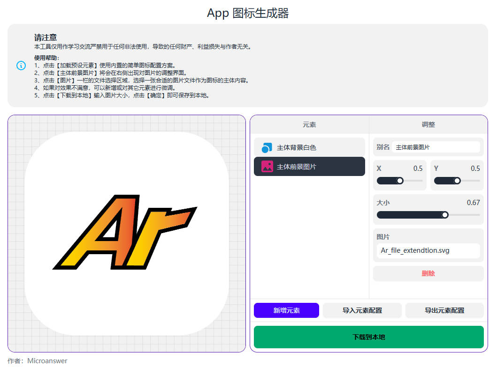

# 本应用定位：适合 应用程序 图标生成


通过这个工具，你可以方便快捷的创建一个用于你应用的图标，注意创建的图标并不适用于label文案的修饰。



### 在线体验

点击链接：[图标生成器](https://test.microanswer.cn/iconcreater.html) 立即跳转。


### 0、快速

```cmd
# 本地预览
npm run dev

# 编译
npm run build
```

### 1、使用帮助

<b>使用帮助</b>：<br>
1、点击【加载预设元素】使用内置的简单图标配置方案。<br>
2、点击【主体前景图片】将会在右侧出现对图片的调整界面。<br>
3、点击【图片】一栏的文件选择区域，选择一张合适的图片文件作为图标的主体内容。<br>
4、如果对效果不满意，可以新增或对其它元素进行微调。<br>
5、点击【下载到本地】输入图片大小，点击【确定】即可保存到本地。
